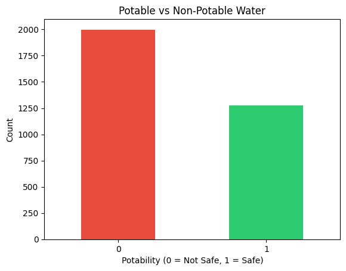
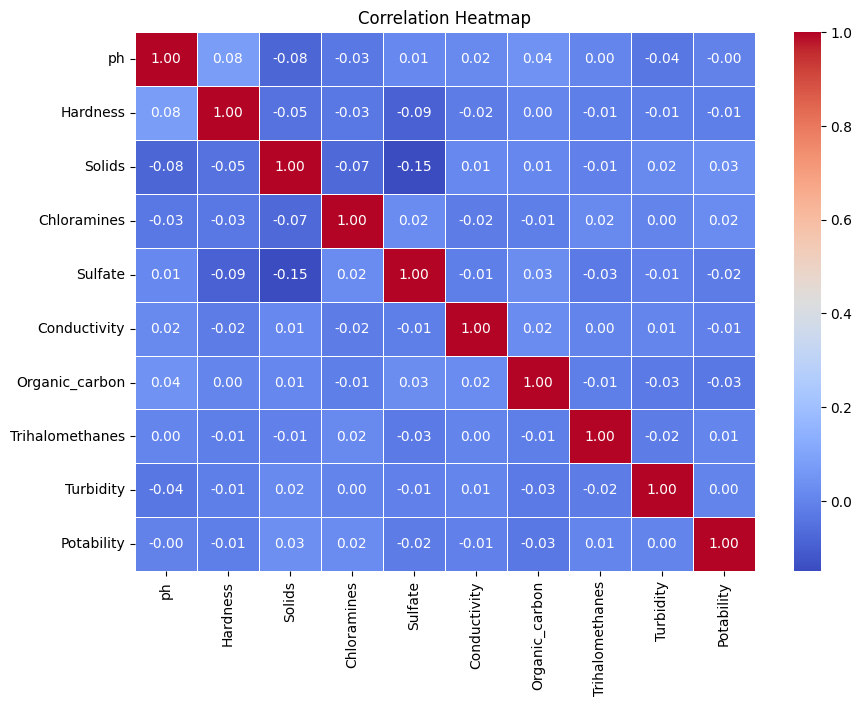
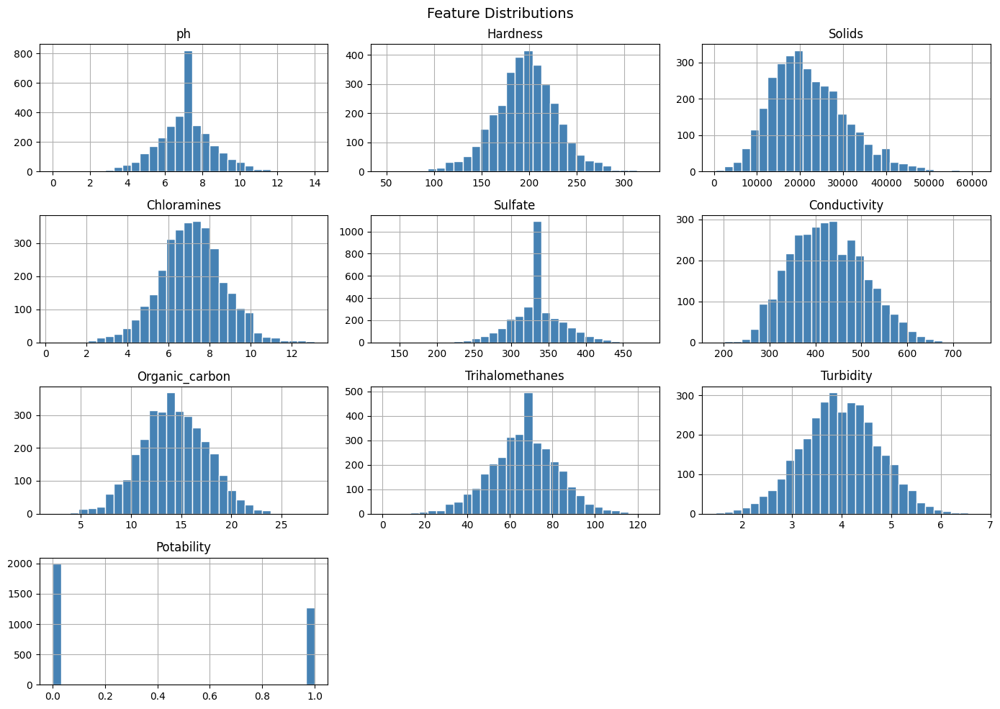
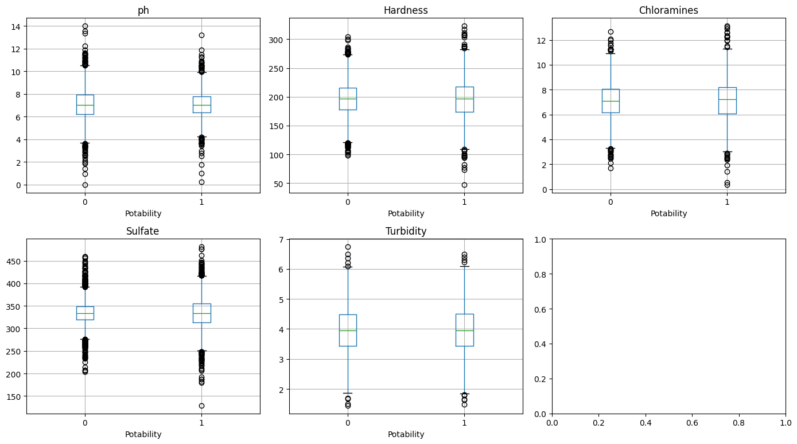
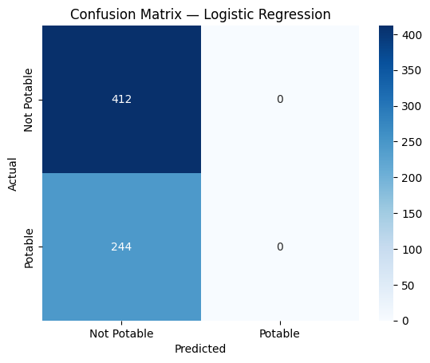
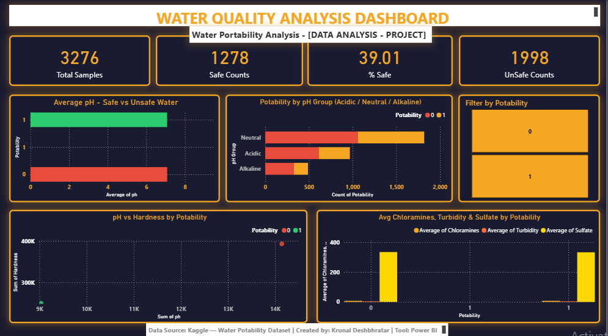

# 💧 Water Quality Potability Analysis & Predictive Modeling

<p align="center">
  
</p>

<p align="center">
  
  
  
  
</p>

---

# 📌 Project Overview

Access to safe drinking water remains one of the most critical public health challenges worldwide.

This project combines **Data Analysis**, **Machine Learning**, and **Business Intelligence** to evaluate water quality and predict whether a water sample is potable (safe for drinking) based on key physicochemical parameters.

The project follows an end-to-end analytics workflow:

- Data Cleaning
- Exploratory Data Analysis (EDA)
- Statistical Investigation
- Machine Learning Modeling
- Performance Evaluation
- Interactive Power BI Dashboard Development

The objective is to transform raw water quality measurements into actionable insights that can support environmental monitoring and public health decision-making.

---

# 🎯 Business Problem

Water contamination can lead to severe health risks.

Organizations responsible for water treatment and monitoring require data-driven methods to:

- Detect unsafe water samples
- Understand key quality indicators
- Monitor compliance with drinking water standards
- Improve decision-making using predictive analytics

This project addresses these challenges by building a classification model capable of predicting water potability.

---

# 📊 Project Highlights

| Metric | Value |
|----------|----------|
| Dataset Size | 3,276 Water Samples |
| Features | 9 Water Quality Parameters |
| Target Variable | Potability (0 = Not Potable, 1 = Potable) |
| Machine Learning Model | Logistic Regression |
| Model Accuracy | ~62% |
| Dashboard Tool | Power BI |
| Programming Language | Python |
| Notebook Environment | Jupyter / Google Colab |

---

# 🧪 Dataset Features

The dataset contains multiple water quality indicators:

| Feature | Description |
|----------|----------|
| pH | Acidity / Alkalinity of water |
| Hardness | Concentration of dissolved minerals |
| Solids | Total dissolved solids |
| Chloramines | Water disinfectant concentration |
| Sulfate | Sulfate concentration |
| Conductivity | Electrical conductivity |
| Organic Carbon | Organic matter concentration |
| Trihalomethanes | By-products of chlorination |
| Turbidity | Water clarity measurement |
| Potability | Drinking water suitability |

---

# 🛠️ Tech Stack

### Programming & Analytics

- Python
- Pandas
- NumPy
- Matplotlib
- Seaborn
- Scikit-Learn

### Business Intelligence

- Power BI

### Development Environment

- Google Colab
- Jupyter Notebook
- GitHub

---

# 🧹 Data Cleaning Process

The dataset contained multiple missing values across important features.

Data preprocessing steps included:

- Missing value identification
- Median-based imputation
- Data validation checks
- Feature consistency verification
- Dataset preparation for machine learning

Result:

✅ Clean dataset with no missing values

File:

```text
data/water_potability_clean.csv
```

---

# 📈 Exploratory Data Analysis

Extensive EDA was performed to understand patterns and relationships within the dataset.

### Key Analyses

- Class Distribution Analysis
- Feature Distributions
- Correlation Analysis
- Outlier Detection
- Statistical Summaries

---

## Class Balance

<p align="center">
  
</p>

### Observation

The dataset exhibits class imbalance:

- Non-Potable samples dominate
- Potable samples form a smaller proportion

This imbalance affects model performance and prediction confidence.

---

## Correlation Analysis

<p align="center">
  
</p>

### Observation

Most features show weak linear correlations with potability.

This indicates that:

- Water safety depends on multiple interacting factors
- Simple threshold-based decisions may not be sufficient

---

## Feature Distributions

<p align="center">
  
</p>

### Insights

Several variables exhibit:

- Skewed distributions
- High variability
- Potential outliers

These patterns justify the need for machine learning approaches.

---

## Boxplot Analysis

<p align="center">
  
</p>

### Observation

Outliers are visible in multiple features, particularly:

- Solids
- Sulfate
- Conductivity
- Trihalomethanes

Such variability is expected in environmental datasets.

---

# 🤖 Machine Learning Model

## Objective

Predict:

```text
Potability
```

Where:

```text
0 → Not Potable
1 → Potable
```

---

## Model Used

### Logistic Regression

Reasons:

- Interpretable baseline classifier
- Fast training
- Suitable for binary classification
- Widely used benchmark model

---

## Modeling Workflow

```text
Raw Data
    ↓
Data Cleaning
    ↓
Feature Selection
    ↓
Train-Test Split
    ↓
Logistic Regression
    ↓
Prediction
    ↓
Performance Evaluation
```

---

# 📉 Model Performance

### Accuracy

```text
≈ 62%
```

### Confusion Matrix

<p align="center">
  
</p>

### Interpretation

The model demonstrates:

✅ Reasonable predictive capability

✅ Ability to identify potable samples

✅ Useful baseline performance

However:

- Class imbalance limits accuracy
- More advanced models may improve results

---

# 💡 Major Findings

### Finding 1

Water quality indicators alone do not exhibit strong individual correlations with potability.

---

### Finding 2

Water safety is influenced by combinations of multiple variables rather than a single factor.

---

### Finding 3

Significant variability exists across environmental measurements.

---

### Finding 4

Class imbalance presents a challenge for machine learning performance.

---

### Finding 5

Predictive analytics can assist water quality monitoring programs and early risk detection.

---

# 📊 Power BI Dashboard

An interactive dashboard was developed to provide business-friendly insights.

### Dashboard Features

- Potability Distribution
- Water Quality KPI Monitoring
- Feature Trend Analysis
- Interactive Filtering
- Correlation Exploration
- Executive-Level Visualization

### Dashboard Assets

```text
PowerBI/water_dashboard.pbix
PowerBI/water_dashboard.pdf
PowerBI/water_dashboard.webm
PowerBI/water_quality_Dashboard.png
```

---

## Dashboard Preview

<p align="center">
  
</p>

---

# 📂 Repository Structure

```text
Water-Quality-Potability-Analysis
│
├── PowerBI
│   ├── water_dashboard.pbix
│   ├── water_dashboard.pdf
│   ├── water_dashboard.webm
│   └── water_quality_Dashboard.png
│
├── data
│   ├── water_potability.csv
│   └── water_potability_clean.csv
│
├── notebooks
│   ├── 01_eda.ipynb
│   ├── 02_cleaning.ipynb
│   ├── 03_model.ipynb
│   └── Data_Analysis_Notebooks.zip
│
├── project_report
│   ├── Water-Quality-Analysis_Report.docx
│   └── Water_Quality_Analysis-Report.pdf
│
├── visuals
│   ├── boxplots.png
│   ├── class_balance.png
│   ├── confusion_matrix.png
│   ├── correlation_heatmap.png
│   ├── feature_distributions.png
│   └── water_quality_Dashboard.png
│
└── README.md
```

---

# 🚀 Skills Demonstrated

### Data Analytics

- Data Cleaning
- Data Validation
- Exploratory Data Analysis
- Statistical Interpretation

### Data Visualization

- Matplotlib
- Seaborn
- Dashboard Design
- KPI Development

### Machine Learning

- Logistic Regression
- Classification Modeling
- Train-Test Split
- Model Evaluation
- Confusion Matrix Analysis

### Business Intelligence

- Power BI Dashboard Development
- Interactive Reporting
- Data Storytelling

### Software & Tools

- Python
- Jupyter Notebook
- Google Colab
- GitHub

---

# 🔮 Future Improvements

Potential enhancements include:

- Random Forest Classifier
- XGBoost
- Feature Engineering
- Hyperparameter Optimization
- Cross Validation
- Class Imbalance Handling (SMOTE)
- Model Comparison Dashboard
- Real-Time Water Monitoring Integration

---

# 📝 Project Report

Detailed project documentation is available in:

```text
project_report/Water_Quality_Analysis-Report.pdf
```

---

# 👨‍💻 Author

## Krunal Deshbhratar

Chemical Engineering Undergraduate  
National Institute of Technology Warangal (NITW)

### GitHub

https://github.com/krunaldeshbhratar9-git

---

# ⭐ If you found this project useful

Consider giving the repository a star.

It helps support future open-source data analytics and machine learning projects.

---
